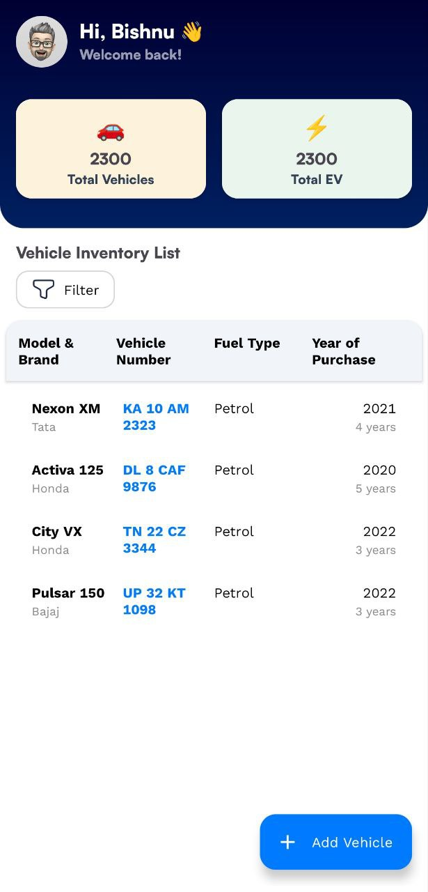
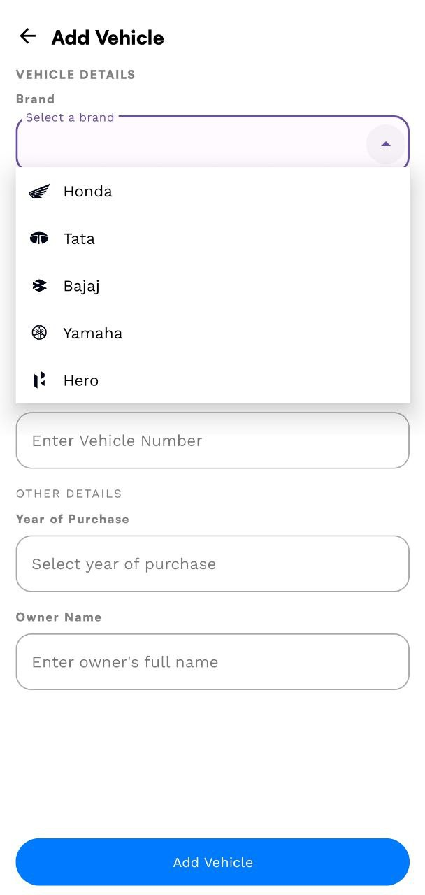
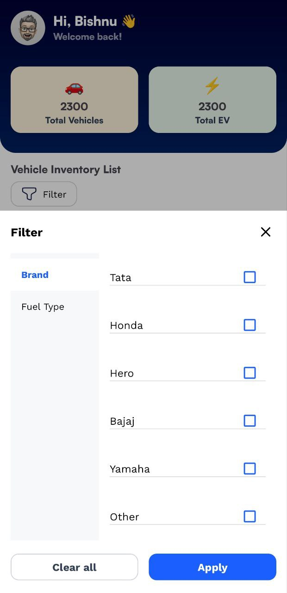

# 🚗 Vehicle Inventory Management App

An Android application built using **Kotlin**, following **MVVM architecture**, and using **Room (SQLite)** for local data storage. This app allows users to manage vehicle inventory with features like adding, filtering, and listing vehicles by brand, fuel type, and more.

---

## 📱 Features

- 🔍 Filter vehicles by brand, model, fuel type, etc.
- ➕ Add vehicle details with ease
- 🧠 Clean MVVM architecture
- 💾 Room Database for local storage
- 🧪 Unit-test-ready code structure
- 💡 Responsive UI with modern Android components

---

## 🛠️ Tech Stack

| Layer         | Tech Used                           |
|--------------|-------------------------------------|
| Language      | Kotlin                             |
| Architecture  | MVVM                               |
| UI            | Jetpack Compose / XML (whichever you used) |
| Database      | Room (SQLite)                      |
| Tools         | Android Studio, ViewModel, LiveData, RecyclerView, etc. |

---

## 📸 Screenshots

| Home Screen | Add Vehicle | Filter Options |
|-------------|-------------|----------------|
|  |  |  |

---

## 🧑‍💻 Project Structure

com.example.vehicleinventorymanagement
│
├── data
│ ├── dao
│ └── model
│ ├── BrandItem.kt
│ ├── FilterOption.kt
│ ├── FuelType.kt
│ ├── Vehicle.kt
│ ├── VehicleBrand.kt
│ └── VehicleModel.kt
│
├── repository
│ ├── FilterRepository.kt
│ └── VehicleRepository.kt
│
├── ui
│ ├── adapter
│ │ ├── BrandAdapter.kt
│ │ ├── FilterOptionAdapter.kt
│ │ ├── FuelTypeAdapter.kt
│ │ ├── RadioListAdapter.kt
│ │ ├── VehicleAdapter.kt
│ │ ├── VehicleBrandAdapter.kt
│ │ └── VehicleModelAdapter.kt
│ └── viewmodel
│ ├── FilterViewModel.kt
│ └── VehicleViewModel.kt
│
├── AddVehicleActivity.kt
├── FilterBottomSheet.kt
└── MainActivity.kt
